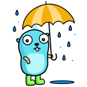

<!--
SPDX-FileCopyrightText: 2023 Winni Neessen <wn@neessen.dev>

SPDX-License-Identifier: CC0-1.0
-->

# go-meteologix - Go packages for accessing Meteologix/Kachelmann Wetter/WeatherUS data

[](https://pkg.go.dev/github.com/wneessen/go-meteologix)
[](https://codecov.io/gh/wneessen/go-meteologix)
[](https://goreportcard.com/report/github.com/wneessen/go-meteologix)
[](https://discord.gg/TvNMuDh4pK)
[](https://api.reuse.software/info/github.com/wneessen/go-meteologix)
<a href="https://ko-fi.com/D1D24V9IX"></a>

<p align="center"></p>

## *This package is still WIP*

This Go package provides simple bindings to the 
[Meteologix/Kachelmann-Wetter API](https://api.kachelmannwetter.com/v02/_doc.html#/).
It provides access to "Stations", "Current Weather" and "Forecast". An API key or 
username/password pair is required to access the endpoints. An API key can be configured
in your [account settings](https://accounts.meteologix.com/subscriptions).

go-meteologix follows idiomatic Go style and best practice. It's only dependency is 
the Go Standard Library.

For Geolocation lookups, the package makes use of the 
[OpenStreetMap Nominatim API](https://nominatim.org/). This requires no API key.

## Usage

The library is fully documented using the execellent GoDoc functionality. Check out 
the [full reference on pkg.go.dev](https://pkg.go.dev/github.com/wneessen/go-hibp) for 
details.

## Examples

### GeoLocation lookup

This program uses the OSM Nominatim API to lookup the GeoLocation data for *Berlin, Germany*.
On success it will return the `Latitude` and `Longitude` fields.
```go
package main

import (
	"fmt"
	"os"

	"github.com/wneessen/go-meteologix"
)

func main() {
	c := meteologix.New()
	gl, err := c.GetGeoLocationByName("Berlin, Germany")
	if err != nil {
		fmt.Println("GeoLocation lookup failed", err)
		os.Exit(1)
	}
	fmt.Printf("GeoLocation - Latitude: %f, Longitude: %f\n", gl.Latitude,
		gl.Longitude)
}
```

### Lookup stations at a specific geolocation

This program makes use of the GeoLocation support in the package. It looks up the GeoLocation
of the location in question and queries the Kachelmann API for the station nearest to that
location. The returned list of stations is sorted by distance to the provided GeoLocation. In
our example we will return the first station in that list.
```go
package main

import (
	"fmt"
	"os"

	"github.com/wneessen/go-meteologix"
)

func main() {
	c := meteologix.New(meteologix.WithAPIKey(os.Getenv("API_KEY")))
	sl, err := c.StationSearchByLocation("Berlin, Germany")
	if err != nil {
		fmt.Printf("station lookup failed: %s", err)
		os.Exit(1)
	}
	if len(sl) > 0 {
		fmt.Printf("Station no. 1: %+v", sl[0])
	}
}
```

### Get latest station observation by station ID

This program takes a station ID and looks up the latest station observation data and returns
the Observation type. This type then has lots of methods to access the observation data. In
our example we will print out the formatted values for the current temperature and the dewpoint.

```go
package main

import (
	"fmt"
	"math"
	"os"

	"github.com/wneessen/go-meteologix"
)

func main() {
	c := meteologix.New(meteologix.WithAPIKey(os.Getenv("API_KEY")))
	o, err := c.ObservationLatestByStationID("H744")
	if err != nil {
		fmt.Printf("station lookup failed: %s", err)
		os.Exit(1)
	}
	fmt.Printf("Temperature at station: %s\n", o.Temperature())
	if !math.IsNaN(o.Temperature().Value()) {
		fmt.Printf("Temperature at station in F: %s\n", o.Temperature().FahrenheitString())
    }
	if o.Dewpoint().IsAvailable() {
		fmt.Printf("Dewpoint in Fahrenheit: %s\n", o.Dewpoint().FahrenheitString())
	}
}
```

### Get latest station observation by location

This program takes a location string, searches for the weather station with the shortest distancen and looks up 
the station's latest observation data. We then print out the temperature in C and F, as well as the station name
and the time of the measurement (if the data point is available from that station).

```go
package main

import (
	"fmt"
	"os"

	"github.com/wneessen/go-meteologix"
)

func main() {
	c := meteologix.New(meteologix.WithAPIKey(os.Getenv("API_KEY")))
	o, s, err := c.ObservationLatestByLocation("Ehrenfeld, Germany")
	if err != nil {
		fmt.Printf("Failed: %s\n", err)
		os.Exit(1)
	}
	if o.Temperature().IsAvailable() {
		fmt.Printf("Temperature at %s: %s/%s (time of measurement: %s)\n",
			s.Name, o.Temperature(), o.Temperature().FahrenheitString(),
			o.Temperature().DateTime().Local().Format("15:04h"))
	}
}
```

## Authors/Contributors
go-meteologix was authored and developed by [Winni Neessen](https://github.com/wneessen/).

Big thanks to the following people, for contributing to the go-meteologix project
(either in form of code, reviewing code, writing documenation or contributing in any other form):
* [Maria Letta](https://github.com/MariaLetta) (designed the go-meteologix logo)

## Mirror

Please note that the repository on Github is just a mirror of
[https://github.com/wneessen/go-meteologix](https://github.com/wneessen/go-meteologix) 
for ease of access and reachability.